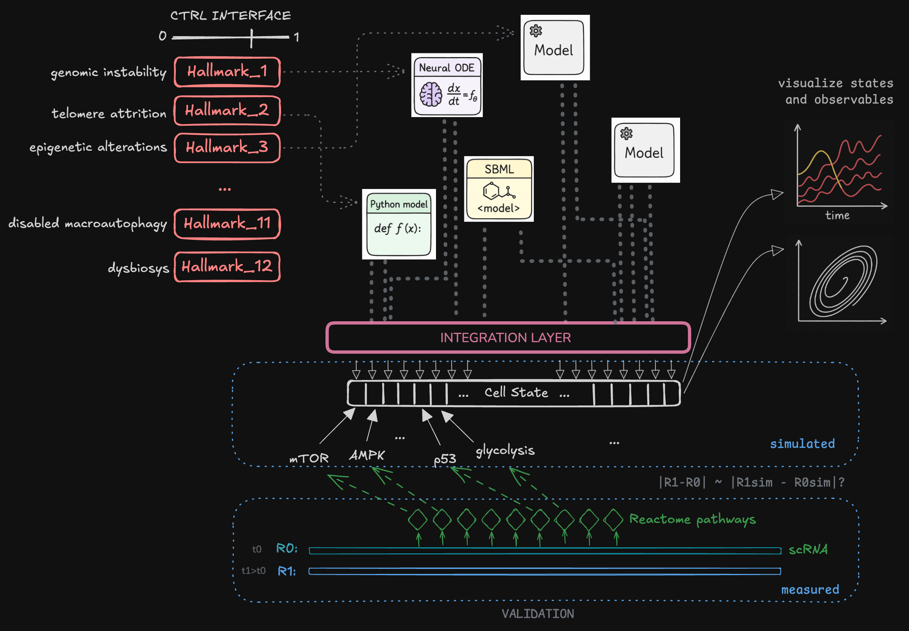

# HallSim: A Modular, Multi-Scale Simulator for Aging Biology
[](https://github.com/BabaJaguska/HallSim/actions/workflows/basic_CI_linux.yaml)

## Background & Motivation

Aging is a complex, network-level phenomenon. Its hallmarks — such as mitochondrial dysfunction, genomic instability, and altered intercellular communication — do not act in isolation. Instead, they form dense webs of feedback and crosstalk.

Traditional approaches to modeling aging have been reductionist. Inspired by conceptual frameworks like Cohen et al. (2022) [1], HallSim aims to embrace complex systems theory and explore emergent properties of aging arising from loss of resilience across multiple sub-systems.

Existing bio simulation tools and model repositories provide standardized formats and simulation capabilities for individual dynamical models, but they generally lack support for composable model libraries — i.e., reusable modules with defined high-level interfaces that can be assembled into heterogeneous larger multi-scale dynamical systems.

HallSim's goal is to enable compositional co-simulation of reusable systems-biology modules, with a focus on aging biology.

---

## Project Goals

* Build a modular, multi-scale simulator for aging biology
* Allow plug-and-play modules with exposed high-level abstractions corresponding to 12 hallmarks of aging [2]
* Enable simulation of aging trajectories, interventions, and emergent phenotypes
* Validate simulations against real experimental data (ssGSEA pathway scores from scRNA-seq)
* Serve as an educational tool and in-silico testbed for perturbations (rapamycin, caloric restriction, etc.)

---

## Architecture



HallSim is built on a **composable architecture** using JAX/Equinox/Diffrax. Design borrows composition semantics from Vivarium [3] and scheduling concepts from Ptolemy II [5], implemented natively on JAX for GPU acceleration and differentiability.

**Scope:** HallSim deliberately covers a narrower set of modeling formalisms than Vivarium-collective in exchange for end-to-end differentiability, JIT, and native batched populations. See [docs/formalism-coverage.md](docs/formalism-coverage.md) for the full coverage table and the trade-off rationale.

**Core concepts:**

| Concept       | Description |
|---------------|-------------|
| **Process**   | Equinox module (`eqx.Module`) — declares typed ports and a `kind` (CONTINUOUS / DISCRETE / EVENT). Parameters are JAX arrays: differentiable, JIT-compilable, vmappable. |
| **Port**      | Named connection point with a role (`INPUT` / `EVOLVED` / `EXCLUSIVE` / `LATCHED`), default value, units, description, and ontology annotation. |
| **Topology**  | Static wiring map `{proc_name: {port_name: store_path}}`. Defined at composition time, not inside processes. |
| **Composite** | Bundles processes + topology. `build_rhs()` / `build_group_rhs()` return JAX-compatible ODE right-hand sides. Auto-groups continuous processes by timescale. |
| **Scheduler** | The unified runner — handles every composite shape. Multi-rate orchestrator: groups continuous processes by timescale (Lie splitting), dispatches discrete processes at intervals, fires events at sync points. Supports `coupling_mode="interpolated"` for dense-output coupling between groups. For single-group continuous composites with no events, takes a fast path that issues one `diffrax.diffeqsolve` over the whole `t_span` (no per-macro-step overhead). The state pipeline is shape-polymorphic — pass a `(n_vars,)` y0 tensor for a single run or a `(batch, n_vars)` tensor for a JAX-native population study, no extra `vmap` required. See [design doc](docs/design-multiscale-scheduler.md). |
| **Store**     | Flat `dict[str, jnp.ndarray]` with path-like keys (e.g., `"cytoplasm/ROS"`). A valid JAX PyTree. |

**Process kinds:**

- `CONTINUOUS` (default) — computes `derivative(t, state) -> dy/dt`, solved by Diffrax ODE integrator.
- `DISCRETE` — computes `update(t, state) -> delta`, called every `dt_step` seconds by the Scheduler.
- `EVENT` — declares `condition(t, state) -> bool` and `handler(t, state) -> delta`, fires on False-to-True crossing.

**Port roles:**

- `INPUT` — read-only, process uses this value but doesn't write a derivative.
- `EVOLVED` — additive: multiple processes can contribute derivatives to the same store path (summed).
- `EXCLUSIVE` — sole ownership: only one process may write to this store path (validated at composition time).
- `LATCHED` — written by discrete/event processes, read as constant by continuous processes within a macro step.

**Validation layer** (optional, runs at composition time):

| Subsystem          | What it checks |
|--------------------|----------------|
| **UnitChecker**    | pint-based dimensional analysis across shared store paths |
| **SemanticChecker**| Ontology ID comparison (ChEBI, GO, SBO) for species disambiguation |
| **GraphAnalyzer**  | Feedback cycle detection, fan-in analysis, coupling density |
| **CouplingAuditor**| Heuristic duplicate-reaction detection via description overlap |

Validation is warnings-by-default (not errors). Use `strict=True` to promote warnings to errors.

### Included Models

| Model | Module | Description |
|-------|--------|-------------|
| **ERiQ** | `hallsim.models.eriq` | Energy Restriction in Quiescence [4] — decomposed into 3 composable Processes: EnergyMetabolism (4 ODEs), OxidativeStress (3 ODEs), Signaling (4 ODEs). 11 state variables, ~20 algebraic intermediates. |
| **SaturatingRemoval** | `hallsim.models.saturating_removal` | Uri Alon's damage accumulation with Michaelis-Menten repair. |
| **NeuralODE** | `hallsim.models.neuralode` | MLP-parameterized dynamics — trainable surrogate or unknown-dynamics learner. Includes training infrastructure. |
| **SBML Import** | `hallsim.sbml_import` | Auto-generate Process from BioModels SBML via `sbmltoodejax`. |
| **Sivakumar2011** | `models/sivakumar2011/` | 5 SBML models of neural stem cell signaling: EGF, Shh, Notch, Wnt, and integrated crosstalk (BIOMD0000000394-398). |
| **StemCellNiche** | `hallsim.models.stem_cell_niche` | Age-dependent niche deterioration — severity-scaled decay of Wnt, EGF, Shh, Notch ligands. Composes additively with the Sivakumar2011 crosstalk model. Maps to the **Stem Cell Exhaustion** hallmark. |
| **GenomicInstability composite** | `hallsim.models.damage_p53_eriq` | Cross-publication composition: `SaturatingRemoval` (DDR mode, Karin & Alon 2019) → `GZ06` SBML p53-Mdm2 oscillator (BIOMD0000000157, Geva-Zatorsky et al. 2006) → `P53Bridge` → `ERiQ` (Alfego & Kriete 2017, p53 replaced). Three independent literature sources composed via topology alone. Maps to the **Genomic Instability** hallmark via `SaturatingRemoval.alpha`. With `with_sasp_mtor=True` adds `SASPmTORActivator` for the chronic-stress mTOR axis. |
| **SASPmTORActivator** | `hallsim.models.sasp_mtor` | Chronic-stress mTORC1 activation Process — Hill-gated additive contribution to `eriq/mTOR_activity` driven by mito_damage × p53_activity. Captures the kinase-level mTORC1 paradox in DDIS (Carroll 2017, Laberge 2015, Herranz 2015, Houssaini 2018, Fielder 2017). |
| **mTORInhibitor** | `hallsim.models.sasp_mtor` | Rapamycin-like pharmacological perturbation — additive negative driver on `eriq/mTOR_activity` with tunable `strength`. Used to model the DDIS-rescue arm of GSE248823 in the held-out validation. |
| **PathwayMapper** | `hallsim.pathway_mapper` | Multi-input Hill-function readout from mechanistic state (p53, mTORC1, NF-κB, ROS, ATP) to seven ssGSEA-style pathway scores. `eqx.Module`, not a Process. 14 calibratable params; defaults K=0.5, n=4. |

### Hallmark Handles

Each of the 12 hallmarks of aging is represented as a 0-1 severity handle that modulates parameters across processes:

```python
from hallsim.hallmarks import apply_hallmarks
from hallsim.models.eriq import build_eriq_composite

comp = build_eriq_composite()
modified_procs = apply_hallmarks(comp.processes, {
    "Mitochondrial Dysfunction": 0.7,
    "Deregulated Nutrient Sensing": 0.5,
})
# Hallmark severity is differentiable: jax.grad through the whole pipeline
```

**Stem Cell Exhaustion** is mapped to the Sivakumar2011 crosstalk model via the `StemCellNiche` process, which contributes severity-dependent decay to Wnt, EGF, Shh, and Notch signaling:

```python
from hallsim.models.stem_cell_niche import build_niche_crosstalk
from hallsim.scheduler import Scheduler

comp = build_niche_crosstalk(severity=0.6)  # moderate niche deterioration
result = Scheduler().run(comp, t_span=(0.0, 100.0), macro_dt=0.5, save_dt=0.5)
# Wnt, EGF, Shh, Notch ligands decline with severity
```

**Genomic Instability** is mapped to a six-process composite that demonstrates HallSim's cross-publication composability claim. An upstream `SaturatingRemoval` (DDR mode) accumulates DSBs; its output drives an SBML-imported p53-Mdm2 oscillator (Geva-Zatorsky 2006, BIOMD0000000157) via a tunable `psi` INPUT port; the oscillator's `x` (p53 protein) replaces ERiQ's intrinsic algebraic p53 via a tracking bridge. Three independent literature sources composed via topology alone:

```python
from hallsim.models.damage_p53_eriq import build_damage_p53_eriq_composite
from hallsim.scheduler import Scheduler

# Genomic Instability hallmark severity = alpha (DSB induction rate).
# Default 0.01 ≈ baseline; 0.03 = moderate; 0.05 = high.
comp = build_damage_p53_eriq_composite(alpha=0.03)
result = Scheduler().run(comp, t_span=(0.0, 50.0), macro_dt=5.0, save_dt=5.0)
result.ts                                # (n_time,)
result.ys                                # (n_time, n_vars) — raw tensor
result.get("p53/psi")                    # damage signal (D)
result.get("p53/x")                      # imported p53 oscillator
result.get("eriq/p53_activity")          # bridge-driven ERiQ p53
result.get("eriq/mTOR_activity")         # ERiQ downstream readouts
```

**Population studies via batched `y0`.** The Scheduler's state pipeline
is shape-polymorphic — a batched `y0` tensor of shape `(batch, n_vars)`
flows through every group's Diffrax solve as a single batched
computation, no `jax.vmap` over `Scheduler.run` required:

```python
keys = comp.store_keys()
y0 = comp.initial_state_vec(keys)                       # (n_vars,)
y0 = jnp.broadcast_to(y0, (1024, len(keys)))            # (1024, n_vars)
y0 = y0.at[..., keys.index("p53/psi")].set(             # vary IC across cells
    jnp.linspace(0.0, 1.5, 1024)
)
result = Scheduler().run(comp, t_span=(0.0, 50.0), macro_dt=5.0, y0=y0)
result.ys.shape                          # (n_time, 1024, n_vars)
result.get("eriq/p53_activity").shape    # (n_time, 1024)
```

On a GPU this is near-flat in `batch` — kernel launch dominates over
per-cell compute. On CPU, scaling is sub-linear because Python overhead
amortizes across the batch.

The composite has 3 timescale groups (bridge ≈ 0.2, GZ06 ≈ 5, damage ≈ 50) which the `Scheduler` auto-clusters and Lie-splits between groups; a single-group composite of comparable stiffness would be forced into very small adaptive steps. SBML constants are exposed as INPUT ports via `process_from_sbml(..., tunable_params=("psi",))` — the mechanism that lets a HallSim Process drive an imported model's parameter without runtime parameter mutation.

### Data Validation (ssGSEA, held-out)

HallSim mechanistic states are bridged to ssGSEA pathway scores via a
**14-parameter multi-input Hill-function module** (`PathwayMapper`,
[`hallsim.pathway_mapper`](src/hallsim/pathway_mapper.py)). The mapper
is a small `eqx.Module` (not a Process, since it has no own dynamics);
its parameters are JAX arrays so calibration via `jax.grad` works.

```python
from hallsim import PathwayMapper, calibrate_pathway_mapper

mapper = PathwayMapper()  # K=0.5, n=4 defaults
scores = mapper.from_eriq_state(state)  # 7 pathway scores in [0,1]
```

**Held-out validation against GSE248823.** The composite `damage_p53_eriq`
is run under control (α=0.01) and DDIS (α=0.05); seven canonical
pathway scores are computed via PathwayMapper. We compare to real
ssGSEA NES values from GSE248823 (DNA-damage-induced senescence and
RAS-OIS arms). To defend against curve-fitting the validation, we use
a **held-out methodology**:

1. Sign agreement on the *default* mapper is the calibration-invariant
   primary metric (Hill calibration cannot flip a sign of a multi-input
   formula).
2. We calibrate Hill parameters on the DDIS arm and report Pearson r on
   the held-out OIS arm. The two arms drive senescence via different
   upstream mechanisms (DDR vs. oncogene), so an r that survives the
   transfer reflects general senescence biology, not arm-specific fit.

Reproduce with:

```bash
.venv_hallsim/bin/python scripts/run_ssgsea.py        # produce data/ssgsea_deltas.csv
.venv_hallsim/bin/python demos/concordance_ddis.py --plot
```

Headline numbers from GSE248823 (etoposide+rapamycin senescence study,
Tighanimine et al. 2024) — **three held-out arms, two model variants**:

| Variant | DDIS (in-sample) | OIS (held-out) | **Rapamycin rescue (held-out)** |
|---|---|---|---|
| Vanilla ERiQ | +0.992 | +0.897 | **−0.261** ❌ |
| SASP-corrected | +0.922 | +0.921 | **+0.504** ✅ |

The held-out arms test increasingly demanding generalization. **OIS** is
a different senescence type (RAS oncogene rather than DNA damage), so a
calibrated mapper that survives the transfer captures *general*
senescence signature, not arm-specific overfit. **Rapamycin rescue**
tests *intervention prediction*: given the calibrated DDIS-trained
model, can we predict what an mTOR inhibitor does in DDIS cells?

The "SASP-corrected" variant adds [`SASPmTORActivator`](src/hallsim/models/sasp_mtor.py)
(chronic-stress mTORC1 activation; Carroll 2017, Laberge 2015,
Herranz 2015, Houssaini 2018, Fielder 2017) and accepts a
[`mTORInhibitor`](src/hallsim/models/sasp_mtor.py) Process that models
rapamycin pharmacology. This SASP module is *necessary* for intervention
prediction: vanilla ERiQ fits DDIS and OIS but predicts rapamycin moves
pathways the *wrong* way (negative r), while the SASP variant gives up
some in-sample DDIS fit and earns positive rescue concordance.

---

## Getting Started

### Install

```bash
make install        # or make install-dev for development
```

### Run demos

```bash
simulate compose              # ROS production + antioxidant defense ODE
simulate compose-kick         # Same system + mid-run perturbation
simulate multiscale           # Continuous + discrete + event scheduling
simulate validate-demo        # Validation layer catching unit/semantic issues
simulate validate-demo --strict # Strict mode: warnings become errors
simulate info                 # Architecture overview

# Multi-timescale coupling comparison (frozen vs interpolated)
.venv_hallsim/bin/python demos/multiscale_coupling_demo.py
```

### Run tests

```bash
make test
# or directly:
.venv_hallsim/bin/python -m pytest tests/ -v
```

### Python API

```python
import jax.numpy as jnp
from hallsim.process import Process, Port, PortRole
from hallsim.composite import Composite
from hallsim.scheduler import Scheduler

# 1. Define processes
class Decay(Process):
    rate: float = 0.1

    def ports_schema(self):
        return {"x": Port(role=PortRole.EVOLVED, default=1.0, units="uM")}

    def derivative(self, t, state):
        return {"x": -self.rate * state["x"]}

class Growth(Process):
    rate: float = 0.05

    def ports_schema(self):
        return {"x": Port(role=PortRole.EVOLVED, default=1.0, units="uM")}

    def derivative(self, t, state):
        return {"x": self.rate * state["x"]}

# 2. Wire via topology
composite = Composite(
    processes={"decay": Decay(), "growth": Growth()},
    topology={"decay": {"x": "pool/x"}, "growth": {"x": "pool/x"}},
    semantic_validation=True,  # optional: run unit/semantic checks
)

# 3. Solve
result = Scheduler().run(
    composite, t_span=(0.0, 100.0), macro_dt=1.0, save_dt=1.0
)
print(result.ts.shape, result.get("pool/x").shape)
```

### ERiQ Model

```python
from hallsim.models.eriq import build_eriq_composite
from hallsim.scheduler import Scheduler

# Build the 3-process ERiQ composite (11 state variables)
comp = build_eriq_composite()
result = Scheduler().run(
    comp, t_span=(0.0, 1000.0), macro_dt=1.0, save_dt=1.0
)

# Mitochondrial damage accumulates over time
print(result.get("eriq/mito_damage")[-1])
```

### Multi-timescale with Scheduler

```python
from hallsim.process import ProcessKind
from hallsim.scheduler import Scheduler

# Discrete process: fires every dt_step seconds
class CellDivision(Process):
    kind: ProcessKind = ProcessKind.DISCRETE
    dt_step: float = 86400.0  # once per day

    def ports_schema(self):
        return {
            "count": Port(role=PortRole.LATCHED, default=1.0, units="cells"),
            "damage": Port(role=PortRole.INPUT, default=0.0),
        }

    def update(self, t, state):
        can_divide = state["damage"] < 0.8
        return {"count": jnp.where(can_divide, state["count"], 0.0)}

# Scheduler handles multi-rate orchestration
scheduler = Scheduler()
result = scheduler.run(composite, t_span=(0.0, 86400.0), macro_dt=3600.0)
print(result.events)  # log of fired events
```

### Splitting schemes and coupling modes

The Scheduler supports multiple strategies for how groups communicate
during operator splitting. Both the **splitting scheme** (how groups
are ordered) and the **coupling mode** (what state information groups
exchange) are configurable:

```python
# Lie splitting (default): groups solved sequentially, one pass. O(dt) error.
scheduler = Scheduler(splitting="lie", coupling_mode="frozen")

# Strang splitting: symmetric half-steps cancel leading-order error. O(dt²).
scheduler = Scheduler(splitting="strang")

# Interpolated coupling: groups query a dense interpolant of the previous
# group's trajectory instead of a frozen snapshot.
scheduler = Scheduler(coupling_mode="interpolated")

# Adaptive macro_dt: PLL-inspired — shrinks step when coupling residual
# is large, grows when it's been small for several consecutive steps.
scheduler = Scheduler(adaptive_dt=True)

# Combine as needed:
scheduler = Scheduler(splitting="strang", adaptive_dt=True)
```

See `demos/multiscale_coupling_demo.py` for a comparison. On a coupled
oscillator/integrator system with macro_dt=2.0:
- Lie (frozen): baseline
- Lie (interpolated): ~2.4x error reduction on slow coupling variable
- Strang: ~2.3x error reduction on slow coupling variable

Parameters are JAX arrays, so you can differentiate through entire simulations.
`build_rhs()` returns a flat `(rhs_fn, keys)` pair — flat-vector state is what
JAX/Diffrax compile fastest, and `flatten`/`unflatten` convert at the boundary:

```python
import jax

def loss(rate):
    proc = Decay(rate=rate)
    comp = Composite(
        processes={"decay": proc},
        topology={"decay": {"x": "pool/x"}},
        validate=False,
    )
    rhs, keys = comp.build_rhs()
    y_vec = comp.flatten({"pool/x": jnp.array(1.0)}, keys)
    dy_vec = rhs(0.0, y_vec)
    return dy_vec[keys.index("pool/x")] ** 2

grad = jax.grad(loss)(0.1)  # d(loss)/d(rate)
```

---

## Dev Instructions

- `pyproject.toml` is the single source of dependencies.
- To add a model, define a new `Process` subclass in `src/hallsim/models/`.
- Models are aggregated on an additive basis in the ODE RHS via EVOLVED ports. If your model's effect is supposed to be multiplicative, consider using a separate store path and an INPUT port to read the other variable.

### Key files

```
src/hallsim/
  process.py           — Process base class, Port, PortRole, ProcessKind
  store.py             — Store utilities (build, extract, route, validate)
  composite.py         — Composite: wires Processes via Topology, auto-grouping
  scheduler.py         — The runner: multi-rate orchestration + single-group fast path
  validation.py        — Semantic validation layer (4 subsystems)
  hallmarks.py         — Hallmark handles (0-1 severity → parameter modulation)
  data_validation.py   — ssGSEA data validation (simulated vs measured)
  sbml_import.py       — SBML auto-import via sbmltoodejax
  cli.py               — CLI entry points (simulate command group)
  models/
    eriq.py            — ERiQ model decomposed into 3 Processes
    saturating_removal.py — Uri Alon damage model
    neuralode.py       — NeuralODE Process + training infrastructure
```

---

## Roadmap

### Done

* [x] Define composability formalisms (Process/Port/Topology/Composite)
* [x] Semantic validation layer (units, ontology, graph analysis, coupling audit)
* [x] Multi-timescale Scheduler (Lie splitting, discrete dispatch, event detection)
* [x] Single-group fast path (one `diffeqsolve` over the full `t_span` when no events/discrete/adaptive_dt/Strang/interpolated)
* [x] Interpolated coupling mode (dense-output Lie splitting)
* [x] Strang splitting (symmetric half-step, O(dt²) accuracy)
* [x] Adaptive macro_dt (PLL-inspired, shrinks on high coupling residual)
* [x] Native batched-IC support (`Scheduler.run` accepts `(batch, n_vars)` y0 — population studies without external `vmap`)
* [x] ERiQ decomposed into 3 composable Processes (EnergyMetabolism, OxidativeStress, Signaling)
* [x] SaturatingRemoval Process (Uri Alon damage model)
* [x] NeuralODE Process + training infrastructure
* [x] Hallmark handles v2 (immutable parameter modifier, differentiable)
* [x] SBML auto-import (`process_from_sbml` via sbmltoodejax)
* [x] Data validation layer (ssGSEA pathway concordance analysis)
* [x] PathwayMapper (mechanistic state → 7 ssGSEA pathway scores via multi-input Hill)
* [x] Held-out validation against GSE248823 (calibrate on DDIS; evaluate on held-out OIS r ≈ 0.90 *and* held-out rapamycin rescue r ≈ +0.50)
* [x] SASPmTORActivator process (chronic-stress mTORC1 activation; literature-grounded)

### Next — Scheduler & Multi-Scale

* [ ] Combine Strang splitting + interpolated coupling (currently mutually exclusive)
* [ ] Event-bearing and adaptive_dt composites under batched `y0` (currently
  rejected at `Scheduler.run` entry — both rely on Python-side branching that
  doesn't compose with `vmap`)
* [ ] Waveform relaxation (Gauss-Seidel iteration at sync points, from FSI/PLL analogy)
* [ ] Anderson acceleration for waveform relaxation convergence
* [ ] Mori-Zwanzig memory kernel for fast→slow coupling (captures history effects)
* [ ] Coupling residual spectral monitoring (early-warning diagnostic)
* [ ] IFT-based adjoint at sync boundaries (for gradient-based optimization)
* [ ] IMEX (implicit-explicit) solver for stiff multi-scale systems

See [crossgen-suggestions.md](docs/crossgen-suggestions.md) for full analysis.

### Next — Models & Validation

* [x] Sivakumar2011 neural stem cell models (5 SBML, stem cell exhaustion hallmark)
* [x] StemCellNiche process (niche deterioration → hallmark severity)
* [x] Validate ERiQ against DDIS bulk transcriptomics (GSE248823) via ssGSEA — held-out r=0.90 across DDIS→OIS arms, plus +0.50 on the held-out rapamycin rescue
* [ ] **Lipid-metabolism extension** — Tighanimine et al. 2024 (*Nat Metab*, the paper behind GSE248823) identified a G3P/PEtn homeostatic switch as *causal* for senescence (p53 → glycerol kinase activation drives G3P↑; PCYT2 post-translational inactivation drives PEtn↑; lipid droplet biogenesis is the downstream effect). Adding a `LipidMetabolism` Process (states: G3P, PEtn; inputs: `p53_activity`, a PCYT2-PTM proxy; outputs: a senescence-amplifying signal that feeds back into the SASP axis) would let HallSim test their causal claim *in silico* — and the GSE248824 SuperSeries includes the paired metabolomics needed to validate it. Strong follow-up paper: HallSim recapitulates the G3P/PEtn → senescence amplification loop and predicts G3PP/ETNPPL overexpression as senomorphic.
* [ ] **Trajectory-level validation** — GSE248823 has 3 timepoints per arm (DDIS: D00/D07/D14, OIS: D00/D04/D07). Current concordance uses two-endpoint deltas; matching predicted vs. measured pathway-score *trajectories* (rate of change, time-constant ordering across pathways) would be a substantially stronger validation than scalar deltas.
* [ ] Validate against scRNA-seq (Tabula Muris Senis, Ma 2020 caloric restriction) — pseudobulk ssGSEA
* [ ] PINNs: physics-informed loss for NeuralODE training

#### Stochastic DISCRETE / Gillespie support

Several aging mechanisms are intrinsically stochastic at the single-cell
scale and not well-described by the ODE mean-field:

* **Telomere shortening** — discrete length loss (≈50–200 bp) per
  division; aggregate length depends on division-history sampling
* **Somatic mutation accumulation** — Poisson process per genome per
  cell-cycle; rate is the Genomic Instability hallmark
* **Senescence entry** — threshold-on-stochastic-state transition
  (DDR signal accumulates by jumps; entry fires once threshold crossed)

The framework already has the right abstraction (`ProcessKind.DISCRETE`
with `update(t, state) -> delta` and `ProcessKind.EVENT` with
`condition`/`handler`). What's missing is:

* PRNG plumbing — pass a `jax.random.PRNGKey` into the Scheduler and
  thread split keys to each stochastic Process
* A `StochasticDiscrete` example Process (telomere-shortening or
  per-genome mutation Poisson) demonstrating the contract
* Population-level statistics via batched y0 with per-cell PRNG keys
  (the existing batched-IC machinery already gives the cell axis;
  we just need the key axis alongside it)

Out of scope for the preprint (deterministic ERiQ + p53-Mdm2 covers the
composability claim) but a concrete next-quarter milestone.

#### Multi-cell / inter-cell communication

Batched y0 currently gives **N independent cells** — every batch element
runs in isolation. Tissue-level aging biology (niche signaling, paracrine
SASP, contact inhibition) requires cells that *exchange state*. Two
plausible architectures:

* **Mean-field paracrine.** Each cell reads a population aggregate of a
  secreted factor (e.g. SASP-IL6 = mean of all senescent cells'
  secretion). Implementation: a `PopulationAggregate` Process that
  reduces along the batch axis and writes a shared store path read by
  every cell. Works inside one `Scheduler.run` call; gradients flow.
* **Spatial / graph-coupled.** Cells live on a graph (epithelium
  topology, niche geometry); communication is along edges. Reaction-
  diffusion or graph-Laplacian coupling. Heavier — needs a spatial
  state representation orthogonal to the per-cell trailing axis.

Concrete first-cut deliverable: a `PopulationAggregate` Process and a
SASP-propagation demo where the senescence fraction in a population
modulates each individual cell's p53 baseline. Demonstrates that
HallSim's composability extends to inter-cell coupling without leaving
the JAX-native execution model. Out of scope for the preprint; designed
as the natural follow-up paper.

#### Other queued items

* [ ] LLM-assisted model composition
* [ ] FBA / genome-scale metabolism via `jaxopt`-based LP — couples
  ERiQ signaling state to BiGG-scale flux distributions with gradients
* [ ] 3D spatial diffusion & ECM modelling

### Next — SBML Import

* [x] `process_from_sbml` for deterministic ODE-only SBML (Sivakumar2011 set)
* [x] `tunable_params` to expose selected SBML constants as INPUT ports — lets a
  HallSim Process drive an imported model's parameters (e.g. damage signal feeding
  a DDR model's input)
* [ ] **Translate SBML events into `ProcessKind.EVENT`** — generic event translator,
  so models with discontinuous state resets (Proctor 2008 BIOMD0000000188 and
  ~10–20% of curated BioModels) become importable. Diffrax 0.5+ already supports
  events natively; HallSim already has `ProcessKind.EVENT`. The missing piece is
  parsing SBML event MathML (trigger expressions, assignments, delays, persistence)
  and emitting the corresponding `condition` / `handler` methods. Most useful
  long-term enhancement to the SBML pipeline.

---

## License

This project is licensed under the MIT License.

---

## Acknowledgments

The Scheduler's splitting schemes (Strang splitting, interpolated dense-output coupling, adaptive macro_dt) and the multi-scale roadmap were informed by cross-domain analogies generated using [CrossGen](https://github.com/mohamedAtoui/CrossGen), a structure-mapping tool that finds solutions in unrelated fields. Three CrossGen sessions surfaced techniques from gyrokinetic plasma simulation, partitioned fluid-structure interaction, Mori-Zwanzig projection, waveform relaxation, and federated Kalman filtering — many of which turned out to be established methods in those communities for the exact same multi-scale coupling problem. See [docs/crossgen-suggestions.md](docs/crossgen-suggestions.md) for the full analysis.

## References

1. Cohen, Alan A., et al. "A complex systems approach to aging biology." Nature aging 2.7 (2022): 580-591.
2. Lopez-Otin, Carlos, et al. "Hallmarks of aging: An expanding universe." Cell 186.2 (2023): 243-278.
3. Agmon, Eran, et al. "Vivarium: an interface and engine for integrative multiscale modeling in computational biology." Bioinformatics 38.7 (2022): 1972-1979.
4. Alfego, D., & Kriete, A. (2017). Simulation of cellular energy restriction in quiescence (ERiQ)—a theoretical model for aging. Biology, 6(4), 44.
5. Ptolemaeus, C. (Ed.). "System Design, Modeling, and Simulation using Ptolemy II." Ptolemy.org, 2014. (Heterogeneous models of computation, Director abstraction.)
