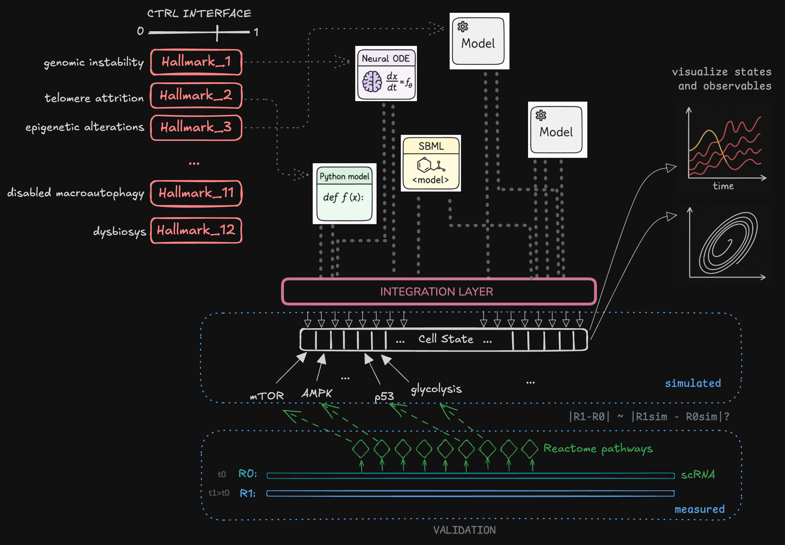

# hallsim
[](https://github.com/BabaJaguska/HallSim/actions/workflows/basic_CI_linux.yaml)

**hallsim composes independently-published systems-biology models into one
multi-scale dynamical system and calibrates the whole thing by gradient descent
through the ODE solve.** Built on JAX, Equinox and Diffrax, for aging biology,
where no single model captures the crosstalk between hallmarks.

The composite stays one differentiable function — many stiff models,
operator-split across timescales — and runs over a population with no `vmap`
to write. A perturbation is a named, differentiable severity, so
rapamycin, caloric restriction or a gene dosage moves the right parameters
across every model at once.



## Quickstart

```bash
make install                 # or: make install-dev
```

```python
import jax.numpy as jnp
from hallsim.process import Process, Port, PortRole
from hallsim.composite import Composite
from hallsim.scheduler import Scheduler

class Decay(Process):
    rate: float = 0.1
    def ports_schema(self):
        return {"x": Port(role=PortRole.EVOLVED, default=1.0, units="uM")}
    def derivative(self, t, state):
        return {"x": -self.rate * state["x"]}

class Growth(Process):
    rate: float = 0.05
    def ports_schema(self):
        return {"x": Port(role=PortRole.EVOLVED, default=1.0, units="uM")}
    def derivative(self, t, state):
        return {"x": self.rate * state["x"]}

composite = Composite(
    processes={"decay": Decay(), "growth": Growth()},
    topology={"decay": {"x": "pool/x"}, "growth": {"x": "pool/x"}},
    semantic_validation=True,   # optional unit/semantic checks
)
result = Scheduler().run(
    composite, t_span=(0.0, 100.0), macro_dt=1.0, save_dt=1.0
)
print(result.get("pool/x").shape)
```

## Workflow

1. **Find** — `supply find <query>` searches the model repositories for a
   deposit that *emits* what you need; `supply find-data <query>` finds a
   time course to calibrate against.
2. **Screen** — `simulate screen <id-or-path>` triages one model on its own.
   Nothing joins a composite unscreened.
3. **Import** — `process_from_sbml` / `process_from_xpp`, then `reconciled_to`
   to put the model on the composite's clock.
4. **Compose** — `Composite` with a topology; `analyze_composability` where
   two models overlap.
5. **Calibrate** — `CalibrationProblem`, scored on held-out arms.

`simulate demo --help` lists the worked examples, including one that composes
three published SBML models and calibrates them against GEO data. `supply
mcp` serves the search to any MCP client. `make test` runs the unit suite.

## License

MIT.

## Citation

https://doi.org/10.64898/2026.09.22.753641
