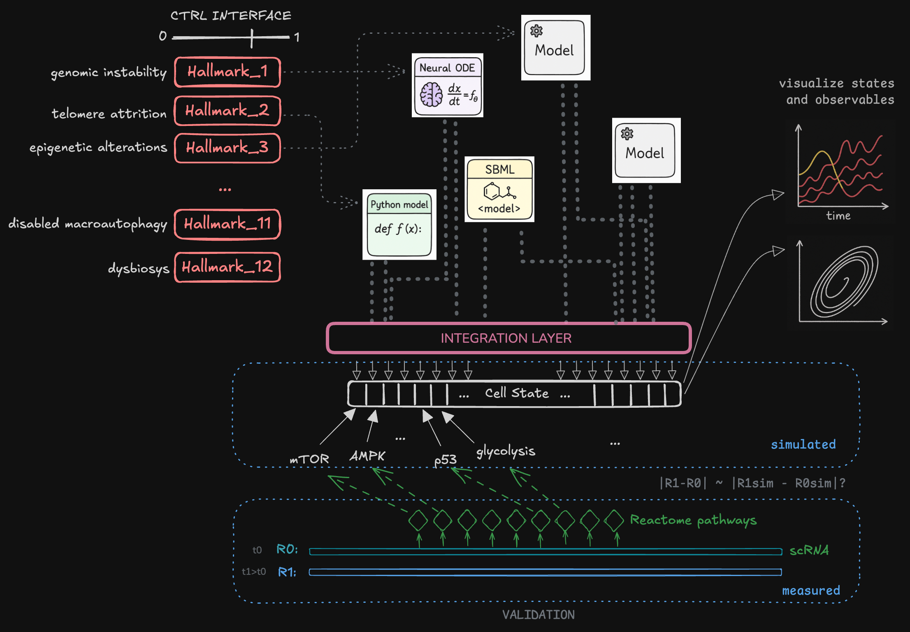

# HallSim architecture

How the framework fits together: the core objects, how processes are wired
and run, the validation layer, how models compose, and how SBML models are
imported. For the calibration/validation side see
[calibration.md](calibration.md); for the multi-rate scheduler internals see
[design-multiscale-scheduler.md](design-multiscale-scheduler.md).



Built on JAX / Equinox / Diffrax. Composition semantics borrow from Vivarium
and scheduling concepts from Ptolemy II, implemented natively on JAX for GPU
acceleration and differentiability. HallSim deliberately covers a narrower
set of modeling formalisms than Vivarium-collective in exchange for
end-to-end differentiability, JIT, and native batched populations — see
[formalism-coverage.md](formalism-coverage.md).

## Core concepts

| Concept | Description |
|---|---|
| **Process** | `eqx.Module` — declares typed ports and a `kind` (CONTINUOUS / DISCRETE / EVENT). Parameters are JAX arrays: differentiable, JIT-compilable, vmappable. |
| **Port** | Named connection point with a role, default value, units, description, and ontology annotation. |
| **Topology** | Static wiring map `{proc_name: {port_name: store_path}}`, defined at composition time — not inside processes. |
| **Composite** | Bundles processes + topology. `build_rhs()` returns a JAX-compatible flat ODE right-hand side over `store_keys()` order. Auto-groups continuous processes by timescale. |
| **Scheduler** | The unified runner for every composite shape — multi-rate orchestration (timescale groups, discrete dispatch, event firing), single-group fast path, shape-polymorphic state (single or batched `y0`). See [scheduler design](design-multiscale-scheduler.md). |
| **Store** | Flat `dict[str, jnp.ndarray]` with path-like keys (`"cytoplasm/ROS"`). A valid JAX PyTree. |

**Flat-state order.** `store_keys()` is natural-sorted — digit runs compare
numerically, so `net/node2` precedes `net/node10` and a generator's own
numbering survives into the state vector. Align any externally-built,
node-indexed array (a weight matrix, a mask, an observation vector) through
`store_index()`, which maps store path → column. Re-deriving the order instead
misaligns silently: with generated port names there is no error, only wrong
numbers.

**Process kinds:**
- `CONTINUOUS` (default) — `derivative(t, state) -> dy/dt`, solved by Diffrax.
- `DISCRETE` — `update(t, state) -> delta`, called every `dt_step` seconds.
- `EVENT` — `condition(t, state) -> bool` + `handler(t, state) -> delta`, fires on a False→True crossing.

**Port roles:**
- `INPUT` — read-only; the process uses the value but writes no derivative.
- `EVOLVED` — additive; multiple processes' derivatives to the same path are summed. A pure source (contribution independent of the path's own value — e.g. a cross-model edge or a running integral) sets `reads_value=False` so the graph analyzer doesn't infer a spurious feedback cycle.
- `EXCLUSIVE` — sole owner; a second writer raises at composition time.
- `LATCHED` — written by discrete/event processes, read as a constant by continuous processes within a macro step.
- `ASSIGNED` — algebraic, not integrated: the process computes the value each step in `assign(t, state)` and is the path's sole owner. Use it for anything defined by a formula rather than a rate (a ratio, a gate, a quasi-steady-state manifold). `Composite` sorts assignments into dependency order automatically, and `SchedulerResult.get` returns them materialised alongside the integrated states.

**Timescales decide grouping.** `Composite.auto_groups` clusters CONTINUOUS
processes by `proc.timescale`, and `timescale=None` is not "don't care" — it
puts the process in its own `"default"` group, which is then *operator-split*
from everything else. A hand-written coupling edge left at the default is
therefore split away from the SBML module it writes into (imports always carry
`timescale=native_time_seconds`), paying splitting error at every macro-step
boundary with nothing in the output to show for it. Give an edge the same
`timescale` as the module it drives; `models/multi_hallmark.py` is the worked
example.

## Validation layer

On by default, runs at composition time (~ms), warnings-by-default but raises
on hard conflicts (incompatible units, ontology mismatch at a shared path):

| Subsystem | Checks |
|---|---|
| **UnitChecker** | pint dimensional analysis across shared store paths |
| **SemanticChecker** | ontology-ID comparison (ChEBI, GO, SBO, UniProt) for species disambiguation |
| **GraphAnalyzer** | feedback-cycle detection, fan-in, coupling density, unfed-INPUT detection |
| **CouplingAuditor** | heuristic duplicate-reaction detection via description overlap |

Promote warnings to errors with `semantic_validation={"strict": True}`;
disable with `semantic_validation=False`; opt out per subsystem with
`semantic_validation={"check_units": False, ...}`. Numerical-range mismatches
at coupled paths are a *calibration* problem, not a validation one — fit the
rate constant(s) with [`Calibrator`](calibration.md).

## Composing composites

`Composite` accepts other `Composite` instances inside its `processes` dict;
they flatten with namespace prefixes (`outer.sub_proc` for processes,
`outer/path` for store paths). A `rewire={old_path: new_path}` kwarg aliases
overlapping biology onto canonical paths.

```python
from hallsim import Composite, analyze_composability
from hallsim.sbml_import import process_from_sbml

a = process_from_sbml(582, name="dp14")   # DallePezze 2014
b = process_from_sbml(157, name="gz06")   # Geva-Zatorsky 2006 (p53 oscillator)
report = analyze_composability(dp14=a, gz06=b)   # candidate overlaps + rewire
merged = Composite(processes={"dp14": a, "gz06": b},
                   rewire=report.suggested_rewire)
```

### Merge or couple? — when two models share a node

Two models both have an "NF-κB" — same entity (merge) or distinct (couple)?
It's an identity question, not a biology one: run
`analyze_composability(a=.., b=..)`. A shared ontology ID ⇒ same entity ⇒
**merge** (point both at one store path; `EVOLVED` sums them;
`report.suggested_rewire` → `Composite(rewire=..)`). No ontology match ⇒ take
the conservative choice — **don't merge; add one documented coupling edge** —
and let a held-out [gene-reporter](calibration.md) split score it. Before
adding a model, `hallsim.diagnostics.recommend_coupling_source` checks whether
it even exposes a usable coupling source (a bounded, consumed state) rather
than a dead sink or an unbounded accumulator.

### Driving a model from outside — pick by what the target *is*

An imported model exposes three kinds of target, and each has its own
primitive. Reaching for the wrong one is how a hand-authored one-off gets
written:

| Target | Primitive |
| --- | --- |
| a constant (SBML parameter) | `ImportedODEProcess.with_param_input` — read a store path as the parameter's value each step |
| a boundary input (`boundaryCondition` species) | `models.forcing.drive_pulse` — a `PulseSource` on `[t_start, t_end)`, or `t_end=None` to sustain |
| a species the model **integrates** | `models.clamp_edge.clamp_species` — a `ClampEdge` holding it at a setpoint |

The third is the one with no obvious workaround: an integrated species is
consumed by the model's own rate laws, so a pulse into it drains away and the
composite can only show an acute response. A `ClampEdge` adds
`k_clamp·(setpoint − target)`, which competes with that consumption rather
than overriding it — additive `EVOLVED` semantics leave no way to preempt
another writer. So the hold is proportional: with net removal flux `v` at the
setpoint, the clamped level settles at `setpoint − v/k_clamp`. Measure `v`
with `measure_unclamped_flux` and pick the rate with `place_clamp_rate`
(which also flags a clamp stiff enough to split off into its own
`auto_groups` group) instead of guessing. `simulate clamp` plots all of it.

## SBML import

[`sbml_import.py`](../src/hallsim/sbml_import.py) auto-generates a Process
from any SBML source via `sbmltoodejax` — BioModels, CellML/Physiome, a paper
supplement — and:

- auto-populates every SBML constant into `SBMLProcess.parameters`, so the
  full mechanism surface is discoverable via `Composite.calibration_targets()`;
- inlines `<functionDefinition>` blocks (via libsbml), unlocking the majority
  of curated models that would otherwise hit "Custom functions are not
  handled" upstream;
- translates `<event>` blocks (see `hallsim.sbml_events`), skipping with a
  warning only those whose assignment target is a parameter rather than a
  species, and pre-flight-rejects unsupported MathML with actionable errors;
- extracts MIRIAM annotations into `Port.ontology` from species CVTerms.

Discover-then-import is two calls — the catalog is directly usable by an agent:

```python
from sbmltoodejax.biomodels_api import search_for_model
from hallsim.sbml_import import process_from_sbml

hits = search_for_model("genotoxic stress NFkB")   # -> [{'id': 'MODEL...'}]
proc = process_from_sbml(hits[0]["id"], name="dna_nfkb")   # fetch + generate
```

Bundled SBML ships as package data under
[`src/hallsim/models/sbml/<author><year>/`](../src/hallsim/models/sbml/) for
offline use; arbitrary IDs download to `~/.cache/hallsim/biomodels/` on first
import.

### On-disk caches

Three, all under `~/.cache/hallsim/`, all safe to delete:

| path | holds | keyed on |
|---|---|---|
| `biomodels/` | SBML downloaded by ID | the BioModels ID |
| `converted/` | function-expanded and event-stripped SBML | the source file's size and mtime |
| `jax/` | XLA's compiled executables, reused across processes | JAX's own hash of the computation |

Writes are atomic, so concurrent processes never read a partial file. Set
`HALLSIM_COMPILATION_CACHE_DIR` to relocate the compile cache, or to `off` to
disable it — which is what you want when timing a cold compile.

## Hallmark handles

Each hallmark of aging is a 0–1 severity handle that modulates parameters
across one or more processes, differentiable end-to-end. Transforms are
**multiplicative of the current calibrated base value** — a transform gets
`(severity, base)` and returns `base * f(severity)` — so `Calibrator` can fit
mechanism parameters and then `apply_hallmarks` at the experimental severity
profile without the hallmark clobbering the fit.

```python
from hallsim import Composite
from hallsim.hallmarks import apply_hallmarks
from demos.models.multi_hallmark import build_multi_hallmark_composite

base = build_multi_hallmark_composite()
# Rapamycin = downward shift on Deregulated Nutrient Sensing (targets DP14's
# mTORC1 phosphorylation rate): severity 1.0 = full dysregulation, 0.3 = rescued.
treated = Composite(
    processes=apply_hallmarks(base.processes,
                              {"Deregulated Nutrient Sensing": 0.3}),
    semantic_validation={"check_semantics": False},
)
```

**Pharmacological interventions belong on the hallmark layer they perturb**,
not as separate Processes. **Cross-model coupling is mediated at the
experimental-condition level where possible**: e.g. Genomic Instability drives
both DP14's `DNA_damaged_by_irradiation` and GZ06's `psi` at each model's own
scale — same severity knob, no state-into-constant patching between the SBML
models (a foot-gun the framework deliberately doesn't expose).

## Example composites

HallSim is a *framework*, not a model library — bring your own Processes
(hand-written, SBML-imported, or a `NeuralODE`). Examples ship under
[`src/hallsim/models/`](../src/hallsim/models/):

- **DP14-anchored multi-hallmark composite**
  ([`multi_hallmark.py`](../src/hallsim/models/multi_hallmark.py)) — three
  BioModels SBML imports (DallePezze 2014 + Geva-Zatorsky 2006 + Ihekwaba
  2004) plus two literature-grounded cross-publication edges into the NF-κB
  module's IKK: `MtorNFkBActivator` (DP14 mTORC1 → IKK; the rapamycin channel)
  and `DamageNFkBActivator` (DP14 DNA_damage → IKK; the genomic-instability /
  ATM→NEMO channel). Spans Cellular Senescence, Deregulated Nutrient Sensing,
  Genomic Instability, and Inflammaging. The current validation composite.
- Hand-written references:
  [`saturating_removal.py`](../src/hallsim/models/saturating_removal.py) (Uri
  Alon damage motif), [`kick_event.py`](../src/hallsim/models/kick_event.py)
  (one-shot EVENT perturbation), the
  [ERiQ](../src/hallsim/models/eriq.py) decomposition, and
  [`neuralode.py`](../src/hallsim/models/neuralode.py).

## Population studies via batched `y0`

The Scheduler's state pipeline is shape-polymorphic — a `(batch, n_vars)` y0
flows through every group's Diffrax solve as one batched computation, no
`jax.vmap` over `Scheduler.run`:

```python
y0 = comp.initial_state_vec()                        # (n_vars,)
y0 = jnp.broadcast_to(y0, (1024, y0.shape[0]))       # (1024, n_vars)
y0 = y0.at[..., comp.store_index()["dp14/DNA_damage"]].set(
    jnp.linspace(0.0, 10.0, 1024))
result = Scheduler().run(comp, t_span=(0.0, 50.0), macro_dt=5.0, y0=y0)
result.get("dp14/CDKN1A").shape                      # (n_time, 1024)
```

Near-flat in `batch` on GPU (kernel launch dominates); sub-linear on CPU
(Python overhead amortizes across the batch).

Batched `y0` broadcasts *initial conditions*. Varying a **parameter** across a
batch — a hallmark severity sweep, for instance — changes the process pytree
rather than the state vector, so it is not a `y0` batch; build one composite
per arm.

## Supporting modules

Small modules a model author needs early, each importable on its own:

| Module | What it gives you |
|---|---|
| `hallsim.kinetics` | `hill_gate`, `hill_inhibition` and friends — the saturating forms every coupling edge needs. Reach for these instead of hand-rolling `x**n / (K**n + x**n)`. |
| `hallsim.io` | `outdir` and `make_run_dir` — the output convention every demo follows (timestamped run directory plus a `latest` symlink). |
| `hallsim.bifurcation` | `equilibrium`, `spectrum`, `codim1_scan` — continuation and stability analysis around a fixed point. `codim1_scan` finds both codimension-1 crossings, Hopf (oscillation onset) and fold (bistability, an invasion threshold), each with its normal-form coefficient. Pass `laws=` for any model with a conserved moiety, or the Newton is singular at every state. Continuation is plain Newton, so a branch is followed only until it folds — tracing both arms of a hysteresis loop needs a multi-seed sweep. |
| `hallsim.stiffness` | `analyze_groups(composite, *, y0, groups, t0, dt)` — per-group spectral abscissa, Jacobian condition number and state-scale spread, with the solver verdict. Keyword-only. |
| `hallsim.diagnostics` | `screen_process` / `screen_composite` (the constituents-first pre-flight), `screen_sensitivity`, and `recommend_coupling_source`. |
